## Example-zOSMF

## Overview ##
z/OS Management Facility, z/OSMF, provides a rich set of REST APIs that allow your application to perform many different types of tasks including working with jobs, data sets, provisioning z/OS Middleware, Notification services, TSO/E functions, z/OS Console and much, much more.   

[z/OSMF REST services](https://ibm.biz/BdYXHX)

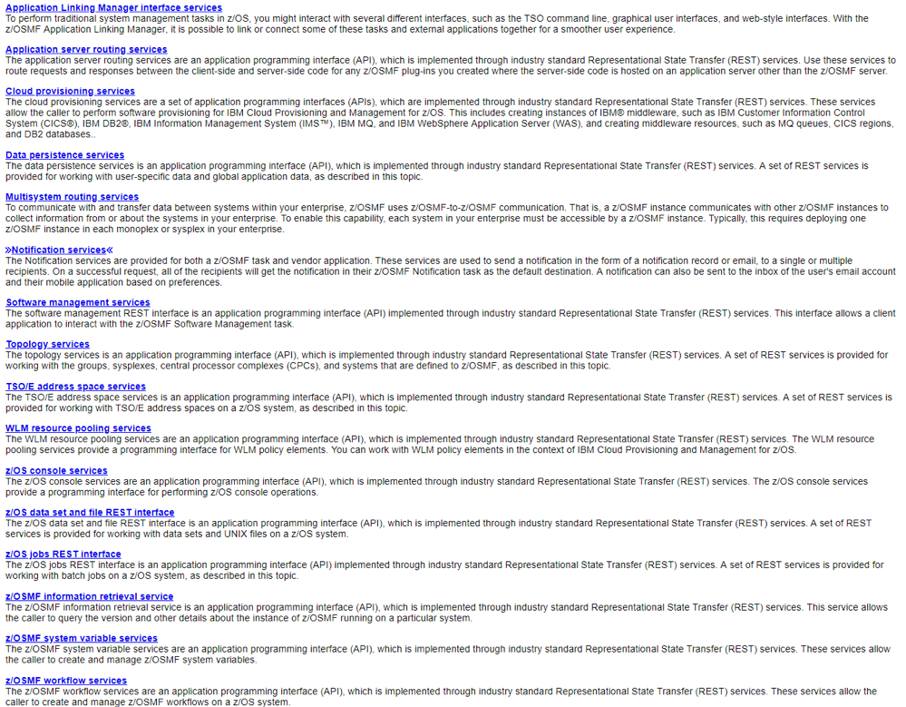

Imagine that your shop would like a certain job on a remote system to be run on a regular basis.  If the resulting job output shows a problem, then you also want to email the output information to the appropriate person so they can address the issue.

This sample illustrates how an application, using the toolkit, can leverage some of the REST APIs listed above, to implement this scenario.

The sample will perform the following steps:
1. Submit a simple z/OS healthcheck job, `HLTHCHK`, using **z/OSMF Submit job REST API**
2. Check the status of the job to make sure it has completed successfully, using **z/OSMF job status retrieval REST API**
3. If the job completed successfully, it will retrieve the output written to a data set, using **z/OSMF data set retrieval REST API**
4. It will then analyze the output.  If the healthcheck failed in any way, then it will send the output to an email address, using **z/OSMF notification REST API**

## Prep work
This sample requires the following
-  A userid on an active z/OSMF server that has permission to issue the following z/OSMF REST services
    - z/OSMF Submit job
    - z/OSMF data set retrieval
    - z/OSMF notification

- The z/OSMF REST Services require an HTTPS connections. The system the sample is on should have [Application Transparent TLS, AT-TLS](https://www.ibm.com/support/knowledgecenter/en/SSLTBW_2.3.0/com.ibm.zos.v2r3.ieac100/attlstoolkit.htm), in place to allows for communication with the z/OSMF server for jobs prefixed with the letters `TKT`.

- Before proceeding further, store `RXZOSMF` and `HLTHCHK` into datasets.

- Updates to the `RXZOSMF` sample

 This sample is designed to be a REXX program run as a batch job.

 First, update the default job name, `TKTxxx1`, to something more appropriate. Keep in mind, the AT-TLS policy definition and if it applies to a specific job prefix

 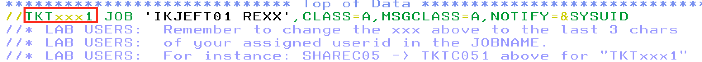

 Now locate the `HTTP_setupSubmitReq` function

 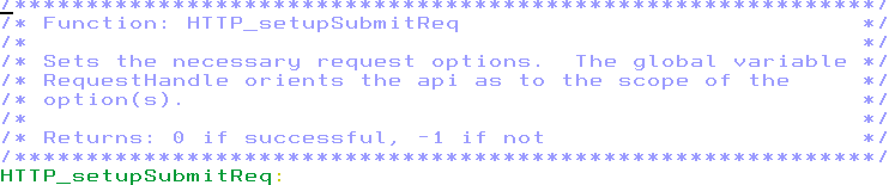

  and make the following two updates in the function

    1. Update `userid` and `password` to valid credentials for an active z/OSMF server referenced above.

    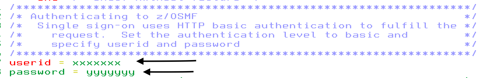

    2. Replace `example.dataset(member)` with the location of your `HLTHCK` job. Don’t remove any of the quotes or you will likely get a REXX syntax error.   

    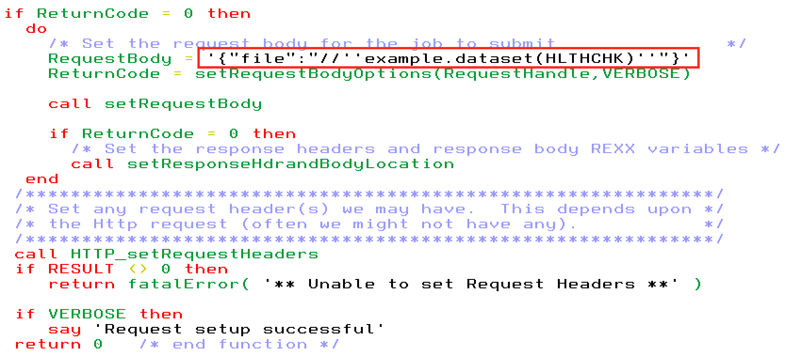

  Next you want to update the location of a zFS file where the trace output will be directed to. This samples is setup to generate verbose output, [`HWTH_OPT_VERBOSE`](https://www.ibm.com/support/knowledgecenter/en/SSLTBW_2.3.0/com.ibm.zos.v2r3.ieac100/ieac1-cwe-http-options.htm), and direct it to a location pointed to by the `MYTRACE` DD name, [`HWTH_OPT_VERBOSE_OUTPUT`](https://www.ibm.com/support/knowledgecenter/en/SSLTBW_2.3.0/com.ibm.zos.v2r3.ieac100/ieac1-cwe-http-options.htm). The `MYTRACE` DD is defined at the bottom of the sample. Replace `/sharelab/sharxxx/sharxxx.trace` with your desired zFS location.

    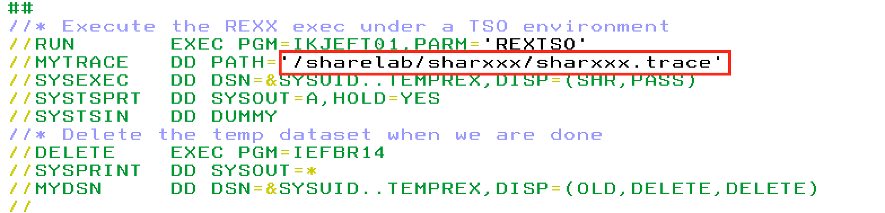

  Lastly you need to update email address that the job failure notification will be sent to.
  Replace `xxxxxxx@yy.zzzzzzz` with a valid email address.

  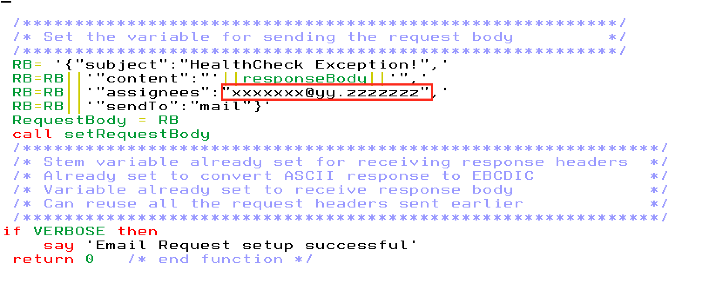

## Invocation
Run the program by simply submitting the RXZOSMF member.   Type **sub** from the command line and hit enter.

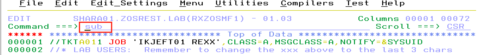

The results of the program are split up between two locations
  - The output of the program is contained in SDSF. Depending on your system, you can go into option 13.14 from the main ISPF menu and then select the H option.  You can sort on jobs with your jobname prefix or owned by your  userid.  For example, if your jobname is TKTLAB01, you can type prefix TKTLAB01.

    The job output will include the following content that resulted from the REXX say statements in the sample

    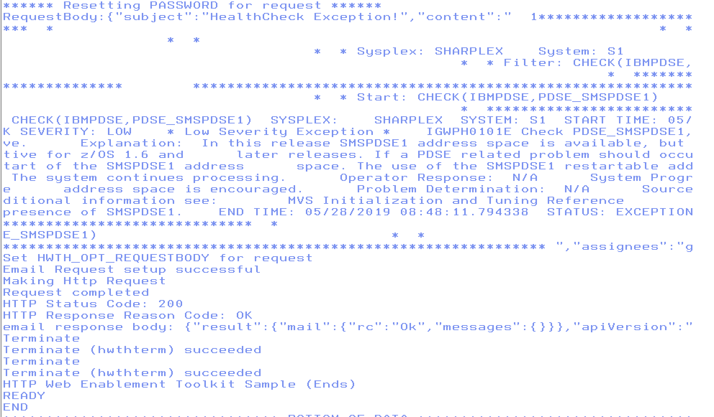

  - The trace output is at the location pointed to by `MYTRACE` DD. For example, if you had update the value of `MYTRACE` to `/sharelab/shara01/shara01.trace` then if you `cd` into `/sharelab/shara01` directory you should now see the `shara01.trace` file.

    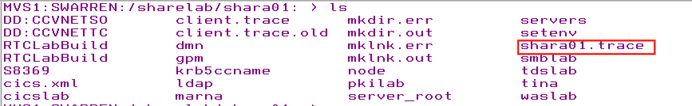

    The content of the trace file will look something like this

    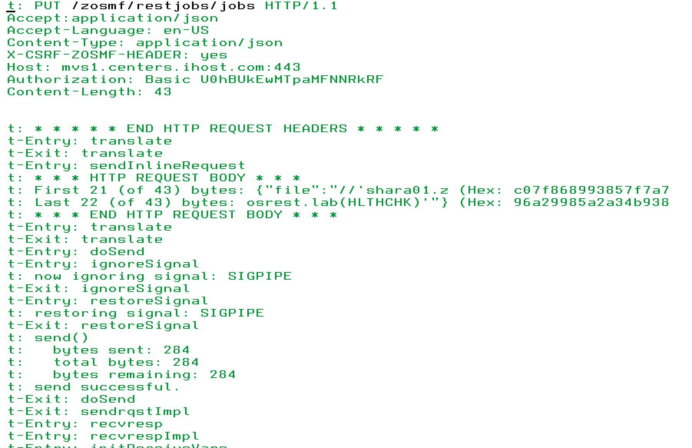

In addition, if the `HLTHCHK` failed, as it is expected to, the email address you specified should have received the following email

  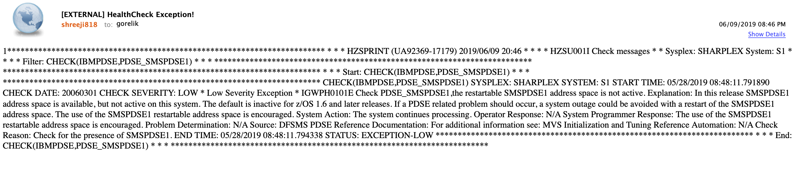
